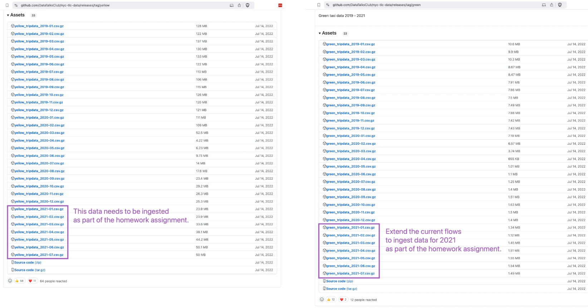

## Module 2 Homework

ATTENTION: At the end of the submission form, you will be required to include a link to your GitHub repository or other public code-hosting site. This repository should contain your code for solving the homework. If your solution includes code that is not in file format, please include these directly in the README file of your repository.

> In case you don't get one option exactly, select the closest one 

For the homework, we'll be working with the _green_ taxi dataset located here:

`https://github.com/DataTalksClub/nyc-tlc-data/releases/tag/green/download`

To get a `wget`-able link, use this prefix (note that the link itself gives 404):

`https://github.com/DataTalksClub/nyc-tlc-data/releases/download/green/`

### Assignment

So far in the course, we processed data for the year 2019 and 2020. Your task is to extend the existing flows to include data for the year 2021.



As a hint, Kestra makes that process really easy:
1. You can leverage the backfill functionality in the [scheduled flow](./flows/06_gcp_taxi_scheduled.yaml) to backfill the data for the year 2021. Just make sure to select the time period for which data exists i.e. from `2021-01-01` to `2021-07-31`. Also, make sure to do the same for both `yellow` and `green` taxi data (select the right service in the `taxi` input).
2. Alternatively, run the flow manually for each of the seven months of 2021 for both `yellow` and `green` taxi data. Challenge for you: find out how to loop over the combination of Year-Month and `taxi`-type using `ForEach` task which triggers the flow for each combination using a `Subflow` task.

### Quiz Questions

Complete the Quiz shown below. It’s a set of 6 multiple-choice questions to test your understanding of workflow orchestration, Kestra and ETL pipelines for data lakes and warehouses.

1) Within the execution for `Yellow` Taxi data for the year `2020` and month `12`: what is the uncompressed file size (i.e. the output file `yellow_tripdata_2020-12.csv` of the `extract` task)?
- **128.3 MB**
- 134.5 MB
- 364.7 MB
- 692.6 MB

**Solution**
- 128.3 MB
**Code**

```bash
id: 02_postgres_taxi
namespace: zoomcamp
description: |
  The CSV Data used in the course: https://github.com/DataTalksClub/nyc-tlc-data/releases

inputs:
  - id: taxi
    type: SELECT
    displayName: Select taxi type
    values: [yellow, green]
    defaults: yellow

  - id: year
    type: SELECT
    displayName: Select year
    values: ["2019", "2020"]
    defaults: "2019"

  - id: month
    type: SELECT
    displayName: Select month
    values: ["01", "02", "03", "04", "05", "06", "07", "08", "09", "10", "11", "12"]
    defaults: "01"

variables:
  file: "{{inputs.taxi}}_tripdata_{{inputs.year}}-{{inputs.month}}.csv"
  staging_table: "public.{{inputs.taxi}}_tripdata_staging"
  table: "public.{{inputs.taxi}}_tripdata"
  data: "{{outputs.extract.outputFiles[inputs.taxi ~ '_tripdata_' ~ inputs.year ~ '-' ~ inputs.month ~ '.csv']}}"

tasks:
  - id: set_label
    type: io.kestra.plugin.core.execution.Labels
    labels:
      file: "{{render(vars.file)}}"
      taxi: "{{inputs.taxi}}"

  - id: extract
    type: io.kestra.plugin.scripts.shell.Commands
    outputFiles:
      - "*.csv"
    taskRunner:
      type: io.kestra.plugin.core.runner.Process
    commands:
      - wget -qO- https://github.com/DataTalksClub/nyc-tlc-data/releases/download/{{inputs.taxi}}/{{render(vars.file)}}.gz | gunzip > {{render(vars.file)}}

  - id: if_yellow_taxi
    type: io.kestra.plugin.core.flow.If
    condition: "{{inputs.taxi == 'yellow'}}"
    then:
      - id: yellow_create_table
        type: io.kestra.plugin.jdbc.postgresql.Queries
        sql: |
          CREATE TABLE IF NOT EXISTS {{render(vars.table)}} (
              unique_row_id          text,
              filename               text,
              VendorID               text,
              tpep_pickup_datetime   timestamp,
              tpep_dropoff_datetime  timestamp,
              passenger_count        integer,
              trip_distance          double precision,
              RatecodeID             text,
              store_and_fwd_flag     text,
              PULocationID           text,
              DOLocationID           text,
              payment_type           integer,
              fare_amount            double precision,
              extra                  double precision,
              mta_tax                double precision,
              tip_amount             double precision,
              tolls_amount           double precision,
              improvement_surcharge  double precision,
              total_amount           double precision,
              congestion_surcharge   double precision
          );

      - id: yellow_create_staging_table
        type: io.kestra.plugin.jdbc.postgresql.Queries
        sql: |
          CREATE TABLE IF NOT EXISTS {{render(vars.staging_table)}} (
              unique_row_id          text,
              filename               text,
              VendorID               text,
              tpep_pickup_datetime   timestamp,
              tpep_dropoff_datetime  timestamp,
              passenger_count        integer,
              trip_distance          double precision,
              RatecodeID             text,
              store_and_fwd_flag     text,
              PULocationID           text,
              DOLocationID           text,
              payment_type           integer,
              fare_amount            double precision,
              extra                  double precision,
              mta_tax                double precision,
              tip_amount             double precision,
              tolls_amount           double precision,
              improvement_surcharge  double precision,
              total_amount           double precision,
              congestion_surcharge   double precision
          );

      - id: yellow_truncate_staging_table
        type: io.kestra.plugin.jdbc.postgresql.Queries
        sql: |
          TRUNCATE TABLE {{render(vars.staging_table)}};

      - id: yellow_copy_in_to_staging_table
        type: io.kestra.plugin.jdbc.postgresql.CopyIn
        format: CSV
        from: "{{render(vars.data)}}"
        table: "{{render(vars.staging_table)}}"
        header: true
        columns: [VendorID,tpep_pickup_datetime,tpep_dropoff_datetime,passenger_count,trip_distance,RatecodeID,store_and_fwd_flag,PULocationID,DOLocationID,payment_type,fare_amount,extra,mta_tax,tip_amount,tolls_amount,improvement_surcharge,total_amount,congestion_surcharge]

      - id: yellow_add_unique_id_and_filename
        type: io.kestra.plugin.jdbc.postgresql.Queries
        sql: |
          UPDATE {{render(vars.staging_table)}}
          SET 
            unique_row_id = md5(
              COALESCE(CAST(VendorID AS text), '') ||
              COALESCE(CAST(tpep_pickup_datetime AS text), '') || 
              COALESCE(CAST(tpep_dropoff_datetime AS text), '') || 
              COALESCE(PULocationID, '') || 
              COALESCE(DOLocationID, '') || 
              COALESCE(CAST(fare_amount AS text), '') || 
              COALESCE(CAST(trip_distance AS text), '')      
            ),
            filename = '{{render(vars.file)}}';

      - id: yellow_merge_data
        type: io.kestra.plugin.jdbc.postgresql.Queries
        sql: |
          MERGE INTO {{render(vars.table)}} AS T
          USING {{render(vars.staging_table)}} AS S
          ON T.unique_row_id = S.unique_row_id
          WHEN NOT MATCHED THEN
            INSERT (
              unique_row_id, filename, VendorID, tpep_pickup_datetime, tpep_dropoff_datetime,
              passenger_count, trip_distance, RatecodeID, store_and_fwd_flag, PULocationID,
              DOLocationID, payment_type, fare_amount, extra, mta_tax, tip_amount, tolls_amount,
              improvement_surcharge, total_amount, congestion_surcharge
            )
            VALUES (
              S.unique_row_id, S.filename, S.VendorID, S.tpep_pickup_datetime, S.tpep_dropoff_datetime,
              S.passenger_count, S.trip_distance, S.RatecodeID, S.store_and_fwd_flag, S.PULocationID,
              S.DOLocationID, S.payment_type, S.fare_amount, S.extra, S.mta_tax, S.tip_amount, S.tolls_amount,
              S.improvement_surcharge, S.total_amount, S.congestion_surcharge
            );

  - id: if_green_taxi
    type: io.kestra.plugin.core.flow.If
    condition: "{{inputs.taxi == 'green'}}"
    then:
      - id: green_create_table
        type: io.kestra.plugin.jdbc.postgresql.Queries
        sql: |
          CREATE TABLE IF NOT EXISTS {{render(vars.table)}} (
              unique_row_id          text,
              filename               text,
              VendorID               text,
              lpep_pickup_datetime   timestamp,
              lpep_dropoff_datetime  timestamp,
              store_and_fwd_flag     text,
              RatecodeID             text,
              PULocationID           text,
              DOLocationID           text,
              passenger_count        integer,
              trip_distance          double precision,
              fare_amount            double precision,
              extra                  double precision,
              mta_tax                double precision,
              tip_amount             double precision,
              tolls_amount           double precision,
              ehail_fee              double precision,
              improvement_surcharge  double precision,
              total_amount           double precision,
              payment_type           integer,
              trip_type              integer,
              congestion_surcharge   double precision
          );

      - id: green_create_staging_table
        type: io.kestra.plugin.jdbc.postgresql.Queries
        sql: |
          CREATE TABLE IF NOT EXISTS {{render(vars.staging_table)}} (
              unique_row_id          text,
              filename               text,
              VendorID               text,
              lpep_pickup_datetime   timestamp,
              lpep_dropoff_datetime  timestamp,
              store_and_fwd_flag     text,
              RatecodeID             text,
              PULocationID           text,
              DOLocationID           text,
              passenger_count        integer,
              trip_distance          double precision,
              fare_amount            double precision,
              extra                  double precision,
              mta_tax                double precision,
              tip_amount             double precision,
              tolls_amount           double precision,
              ehail_fee              double precision,
              improvement_surcharge  double precision,
              total_amount           double precision,
              payment_type           integer,
              trip_type              integer,
              congestion_surcharge   double precision
          );

      - id: green_truncate_staging_table
        type: io.kestra.plugin.jdbc.postgresql.Queries
        sql: |
          TRUNCATE TABLE {{render(vars.staging_table)}};

      - id: green_copy_in_to_staging_table
        type: io.kestra.plugin.jdbc.postgresql.CopyIn
        format: CSV
        from: "{{render(vars.data)}}"
        table: "{{render(vars.staging_table)}}"
        header: true
        columns: [VendorID,lpep_pickup_datetime,lpep_dropoff_datetime,store_and_fwd_flag,RatecodeID,PULocationID,DOLocationID,passenger_count,trip_distance,fare_amount,extra,mta_tax,tip_amount,tolls_amount,ehail_fee,improvement_surcharge,total_amount,payment_type,trip_type,congestion_surcharge]

      - id: green_add_unique_id_and_filename
        type: io.kestra.plugin.jdbc.postgresql.Queries
        sql: |
          UPDATE {{render(vars.staging_table)}}
          SET 
            unique_row_id = md5(
              COALESCE(CAST(VendorID AS text), '') ||
              COALESCE(CAST(lpep_pickup_datetime AS text), '') || 
              COALESCE(CAST(lpep_dropoff_datetime AS text), '') || 
              COALESCE(PULocationID, '') || 
              COALESCE(DOLocationID, '') || 
              COALESCE(CAST(fare_amount AS text), '') || 
              COALESCE(CAST(trip_distance AS text), '')      
            ),
            filename = '{{render(vars.file)}}';

      - id: green_merge_data
        type: io.kestra.plugin.jdbc.postgresql.Queries
        sql: |
          MERGE INTO {{render(vars.table)}} AS T
          USING {{render(vars.staging_table)}} AS S
          ON T.unique_row_id = S.unique_row_id
          WHEN NOT MATCHED THEN
            INSERT (
              unique_row_id, filename, VendorID, lpep_pickup_datetime, lpep_dropoff_datetime,
              store_and_fwd_flag, RatecodeID, PULocationID, DOLocationID, passenger_count,
              trip_distance, fare_amount, extra, mta_tax, tip_amount, tolls_amount, ehail_fee,
              improvement_surcharge, total_amount, payment_type, trip_type, congestion_surcharge
            )
            VALUES (
              S.unique_row_id, S.filename, S.VendorID, S.lpep_pickup_datetime, S.lpep_dropoff_datetime,
              S.store_and_fwd_flag, S.RatecodeID, S.PULocationID, S.DOLocationID, S.passenger_count,
              S.trip_distance, S.fare_amount, S.extra, S.mta_tax, S.tip_amount, S.tolls_amount, S.ehail_fee,
              S.improvement_surcharge, S.total_amount, S.payment_type, S.trip_type, S.congestion_surcharge
            );
  
  # - id: purge_files
  #   type: io.kestra.plugin.core.storage.PurgeCurrentExecutionFiles
  #   description: This will remove output files. If you'd like to explore Kestra outputs, disable it.

pluginDefaults:
  - type: io.kestra.plugin.jdbc.postgresql
    values:
      # url: jdbc:postgresql://host.docker.internal:5432/postgres-zoomcamp # if running on Mac
      url: jdbc:postgresql://postgres_zoomcamp:5432/postgres-zoomcamp # if running on Linux
      username: kestra
      password: k3str4
```

2) What is the rendered value of the variable `file` when the inputs `taxi` is set to `green`, `year` is set to `2020`, and `month` is set to `04` during execution?
- `{{inputs.taxi}}_tripdata_{{inputs.year}}-{{inputs.month}}.csv` 
- **`green_tripdata_2020-04.csv`**
- `green_tripdata_04_2020.csv`
- `green_tripdata_2020.csv`

**Solution**

- green_tripdata_2020-04.csv
**Code**
```bash
variables:
  file: "{{inputs.taxi}}_tripdata_{{inputs.year}}-{{inputs.month}}.csv"
  staging_table: "public.{{inputs.taxi}}_tripdata_staging"
  table: "public.{{inputs.taxi}}_tripdata"
  data: "{{outputs.extract.outputFiles[inputs.taxi ~ '_tripdata_' ~ inputs.year ~ '-' ~ inputs.month ~ '.csv']}}"
```


3) How many rows are there for the `Yellow` Taxi data for all CSV files in the year 2020?
- 13,537.299
- **24,648,499**
- 18,324,219
- 29,430,127

**Solution** 

- 24648499

This is achieved by using the scheduling yaml file then query in Bigquery with the command:
```bash
    SELECT COUNT (*)
    FROM `scenic-dynamo-447811-m9.zoomcamp.yellow_tripdata`
    WHERE filename 
    LIKE 'yellow_tripdata_2020-%';
```

4) How many rows are there for the `Green` Taxi data for all CSV files in the year 2020?
- 5,327,301
- 936,199
- **1,734,051**
- 1,342,034

**Solution** 

- 1734051

This is achieved by using the scheduling yaml file then query in Bigquery with the command:
```bash
    SELECT COUNT (*)
    FROM `scenic-dynamo-447811-m9.zoomcamp.green_tripdata`
    WHERE filename 
    LIKE 'green_tripdata_2020-%';
```

5) How many rows are there for the `Yellow` Taxi data for the March 2021 CSV file?
- 1,428,092
- 706,911
- **1,925,152**
- 2,561,031

**Solution**

- 1925152

```bash
SELECT COUNT (*)
FROM `scenic-dynamo-447811-m9.zoomcamp.yellow_tripdata`
WHERE filename='yellow_tripdata_2021-03.csv';
```

6) How would you configure the timezone to New York in a Schedule trigger?
- Add a `timezone` property set to `EST` in the `Schedule` trigger configuration  
- **Add a `timezone` property set to `America/New_York` in the `Schedule` trigger configuration**
- Add a `timezone` property set to `UTC-5` in the `Schedule` trigger configuration
- Add a `location` property set to `New_York` in the `Schedule` trigger configuration  

**Solution**

```bash
triggers:
  - id: daily
    type: io.kestra.plugin.core.trigger.Schedule
    cron: "@daily"
    timezone: America/New_York
```

## Submitting the solutions

* Form for submitting: https://courses.datatalks.club/de-zoomcamp-2025/homework/hw2
* Check the link above to see the due date

## Solution

Will be added after the due date
